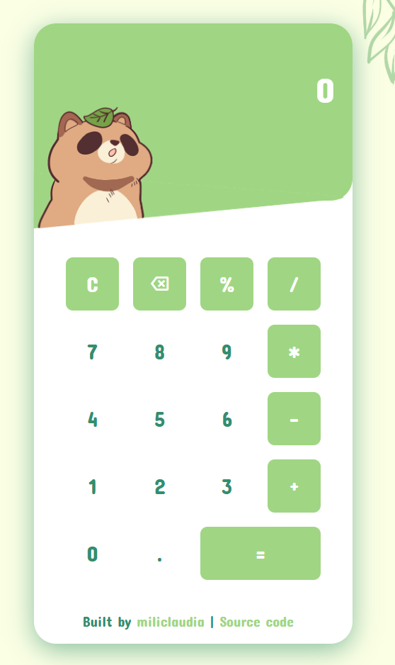

# Calculator

> A simple web calculator with keyboard support and a little friend 🦝🍃

---

## 🖼️ Preview

  

---

## 🛠️ Features

- **Arithmetic operations:** Addition, subtraction, multiplication, division
- **Keyboard support:** Use `0–9`, `+`, `-`, `*`, `/`, `Enter` for equals, `Backspace` to delete, and `Esc` to clear
- **Percentage key:** Quickly calculate percentages
- **Cute Tanuki 🦝

---

## 🎮 Usage

1. **Click** the on-screen buttons or **press** keys on your keyboard:
   - Numbers: `0–9`
   - Decimal point: `.`
   - Operators: `+`, `-`, `*`, `/`
   - Equals: `=` or `Enter`
   - Clear: `C` or `Esc`
   - Delete last: `⌫` (`Backspace`)
   - Percentage: `%`
2. **Read** the live result displayed above.

---

## 📝 Code Structure

- **`index.html`** – Main HTML layout
- **`style.css`** – Styling
- **`script.js`** – Logic for display, calculations, and keyboard handling
- **`images/`** – Assets

